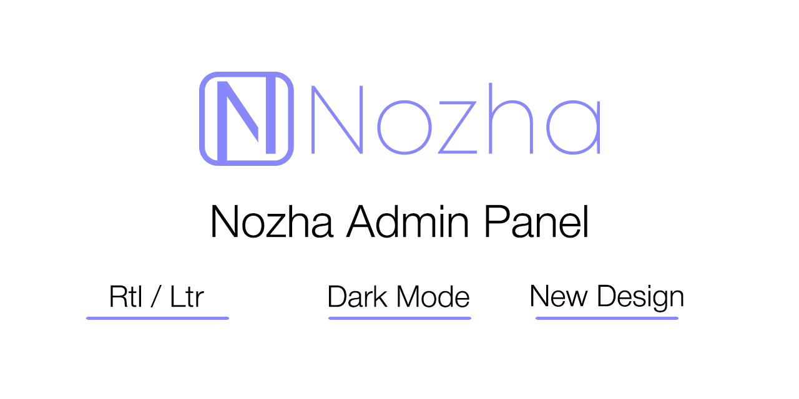
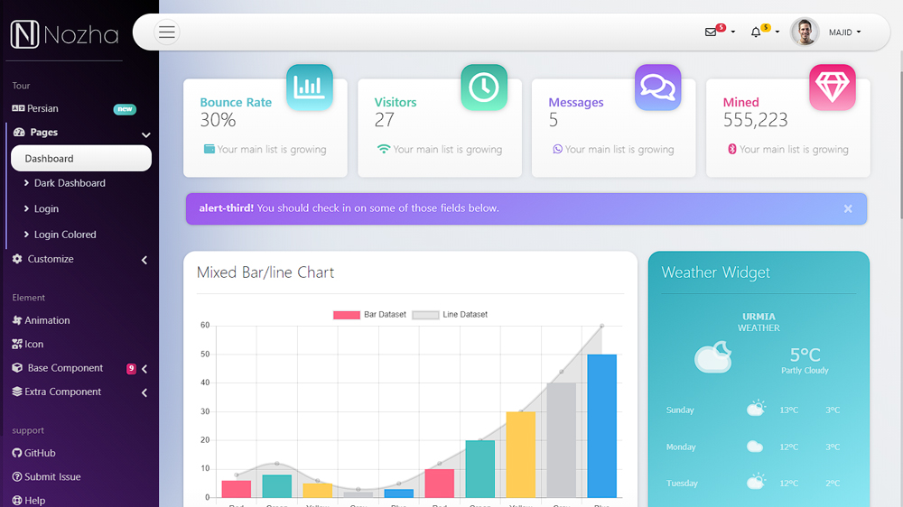
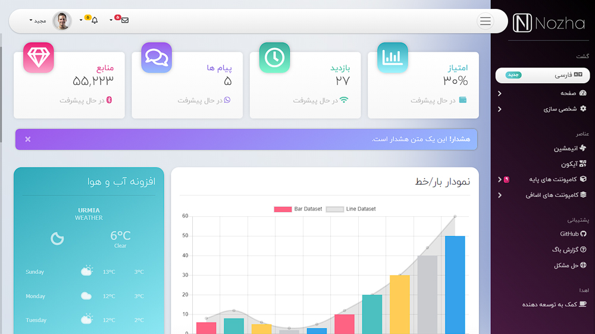

# Nozha-Dashboard:

Nozha Admin Panel is a free to use Bootstrap admin template. This template uses the default Bootstrap 4 styles for creating admin panels or back-end dashboards.
its support Rtl language like persian, arabic and etc .
You can use Dark mode on this theme.

 
# Demo-Picture:
[Demo page](https://majidalinejad.github.io/Nozha-rtl-Dashboard/)
admin panel with doc
***

***

# Farsi Demo-Picture:
[Demo page](https://majidalinejad.github.io/Nozha-rtl-Dashboard/fa.html)
پنل ادمین فارسی به همراه داکیومنت
***

# Scripts included:
- Bootstrap
- Font Awesome
- Charts.js
- jQuery
 
# License information:
Nozha is licensed under OpenSource. Which means that you can use, copy, modify, merge, publish, distribute, sublicense, and/or sell copies of the Software.
Project is developed and maintained by Negarafar and Majid Alinejad.
